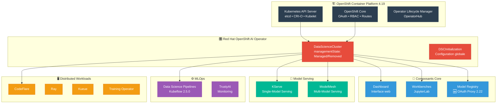
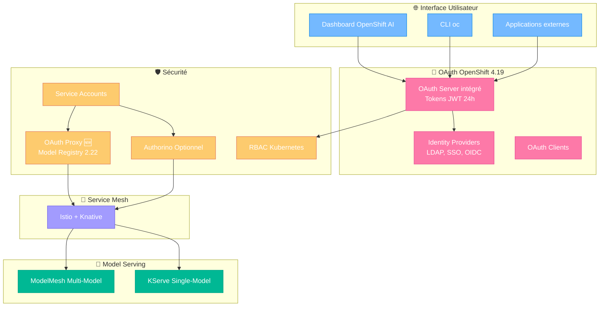

# Architecture OpenShift AI 2.22

Documentation complète de l'architecture OpenShift AI 2.22 sur OpenShift Container Platform 4.19, basée sur la documentation officielle Red Hat.

## 🎯 Vue d'ensemble

Ce repository contient une documentation détaillée de l'architecture OpenShift AI 2.22, incluant :
- Architecture globale des composants
- Architecture d'authentification et sécurité
- Diagrammes interactifs
- Liens vers la documentation officielle

## 📋 Table des matières

# Architecture OpenShift AI 2.22

Documentation complète de l'architecture OpenShift AI 2.22 sur OpenShift Container Platform 4.19, basée sur la documentation officielle Red Hat.

## 🎯 Vue d'ensemble

Ce repository contient une documentation détaillée de l'architecture OpenShift AI 2.22, incluant :
- Architecture globale des composants
- Architecture d'authentification et sécurité
- Diagrammes interactifs
- Liens vers la documentation officielle

## 📋 Table des matières

### 🏗️ Architecture Globale
- [📖 Documentation détaillée](./docs/architecture-globale/README.md)
- [🌐 Diagramme interactif](https://mouachan.github.io/openshift-ai-architecture/docs/architecture-globale/)



### 🔐 Architecture d'Authentification
- [📖 Documentation détaillée](./docs/architecture-auth/README.md)
- [🌐 Diagramme interactif](https://mouachan.github.io/openshift-ai-architecture/docs/architecture-auth/)



## 🚀 Accès rapide

| Architecture | Diagramme interactif | Documentation |
|--------------|---------------------|---------------|
| **Globale** | [🔗 Voir](https://mouachan.github.io/openshift-ai-architecture/docs/architecture-globale/) | [📖 Lire](./docs/architecture-globale/README.md) |
| **Authentification** | [🔗 Voir](https://mouachan.github.io/openshift-ai-architecture/docs/architecture-auth/) | [📖 Lire](./docs/architecture-auth/README.md) |

## 📚 Documentation officielle Red Hat utilisée

### OpenShift AI 2.22
- [Architecture d'OpenShift AI Cloud Service](https://docs.redhat.com/en/documentation/red_hat_openshift_ai_cloud_service/1/html/installing_and_uninstalling_openshift_ai_cloud_service/architecture-of-openshift-ai_install)
- [Architecture OpenShift AI Self-Managed](https://docs.redhat.com/en/documentation/red_hat_openshift_ai_self-managed/2-latest/html/installing_and_uninstalling_openshift_ai_self-managed/architecture-of-openshift-ai-self-managed_install)
- [Installation et déploiement](https://docs.redhat.com/en/documentation/red_hat_openshift_ai_cloud_service/1/html/installing_and_uninstalling_openshift_ai_cloud_service/installing-and-deploying-openshift-ai_install)
- [Serving Models](https://docs.redhat.com/en/documentation/red_hat_openshift_ai_cloud_service/1/html-single/serving_models/index)
- [Nouvelles fonctionnalités 2.22](https://docs.redhat.com/en/documentation/red_hat_openshift_ai_cloud_service/1/html/release_notes/new-features-and-enhancements_relnotes)

### OpenShift Container Platform 4.19
- [Architecture OpenShift](https://docs.redhat.com/en/documentation/openshift_container_platform/4.19/html/architecture/architecture)
- [Understanding Authentication](https://docs.redhat.com/fr/documentation/openshift_container_platform/4.19/html-single/authentication_and_authorization/index#understanding-authentication)
- [Managing OAuth tokens](https://docs.redhat.com/en/documentation/openshift_container_platform/4.19/html-single/authentication_and_authorization/index#managing-oauth-access-tokens)

## 🧩 Composants principaux

### Meta-Operator
- **Red Hat OpenShift AI Operator** : Déploie et maintient tous les composants
- **DataScienceCluster (DSC)** : Configuration avec managementState
- **DSCInitialization (DSCI)** : Configuration globale

### Composants Core
- **Dashboard** : Interface web utilisateur
- **Workbenches** : Environnements JupyterLab
- **Model Registry** : Gestion des modèles (🆕 OAuth Proxy en 2.22)

### Model Serving
- **KServe** : Single-Model Serving pour LLMs
- **ModelMesh** : Multi-Model Serving pour modèles petits/moyens

### MLOps & Pipelines
- **Data Science Pipelines** : Kubeflow Pipelines 2.5.0
- **TrustyAI** : Monitoring et explicabilité

### Distributed Workloads
- **CodeFlare** : SDK Python pour orchestration
- **Ray** : Calcul distribué
- **Kueue** : Gestion des queues
- **Training Operator** : Entraînement distribué

## 🔐 Sécurité et Authentification

### OAuth OpenShift 4.19
- Serveur OAuth intégré
- Tokens JWT avec durée de vie configurable (24h par défaut)
- Identity Providers (LDAP, SSO, OIDC)

### Authentification des modèles
- **Authorino** (optionnel) : Validation tokens pour KServe
- **OAuth Proxy** : Nouveau pour Model Registry en 2.22
- **Service Accounts** : Isolation par namespace
- **RBAC** : Contrôle d'accès basé sur les rôles

## 🛠️ Installation et Configuration

### Prérequis
- OpenShift Container Platform 4.19+
- Stockage S3-compatible (AWS S3, MinIO, Ceph)
- Pour KServe : OpenShift Serverless + Service Mesh

### Configuration managementState
```yaml
apiVersion: datasciencecluster.opendatahub.io/v1
kind: DataScienceCluster
metadata:
  name: default-dsc
spec:
  components:
    dashboard:
      managementState: Managed
    workbenches:
      managementState: Managed
    kserve:
      managementState: Managed
    # ... autres composants
```

## 🆕 Nouveautés OpenShift AI 2.22

- **Model Registry OAuth Proxy** : Plus besoin d'Authorino/Serverless/Service Mesh
- **Kubeflow Pipelines 2.5.0** : Mise à niveau des Data Science Pipelines
- **Opérateur résilient** : 3 répliques pour haute disponibilité
- **Migration automatique** : Instances existantes migrées vers OAuth proxy

## 📱 Formats disponibles

Chaque architecture est disponible en plusieurs formats :
- **HTML interactif** : Diagrammes avec hover et liens cliquables
- **SVG statique** : Images vectorielles haute qualité
- **Mermaid** : Code pour intégration dans Markdown
- **Documentation Markdown** : Explications détaillées avec citations

## 🤝 Contribution

Cette documentation est basée uniquement sur la documentation officielle Red Hat. Les contributions sont les bienvenues pour :
- Mise à jour avec nouvelles versions
- Corrections et améliorations
- Traductions
- Exemples d'implémentation

## 📄 Licence

Cette documentation est fournie à des fins éducatives et de référence, basée sur la documentation publique de Red Hat.

---

**Dernière mise à jour** : Basé sur OpenShift AI 2.22 et OpenShift 4.19  
**Sources** : Documentation officielle Red Hat uniquement
