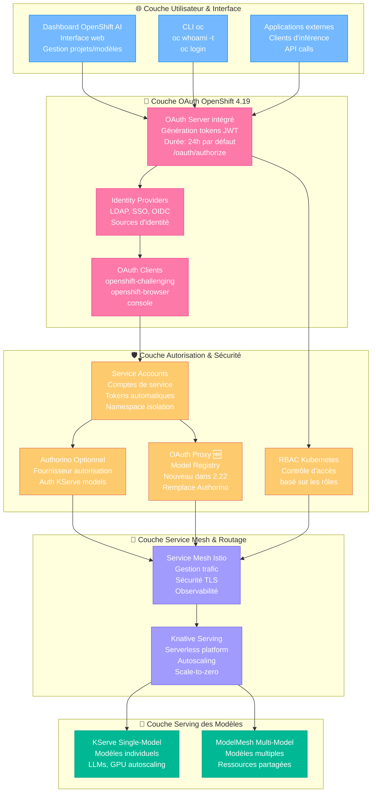

# Architecture d'Authentification OpenShift AI 2.22

## 🔐 Vue d'ensemble

L'authentification dans OpenShift AI 2.22 s'appuie sur le serveur OAuth intégré d'OpenShift Container Platform 4.19, combiné avec des composants spécialisés pour sécuriser les services d'inférence des modèles ML.

## 📊 Diagramme d'architecture d'authentification

👉 **[Voir le diagramme d'authentification interactif](./index.html)**



## 🏗️ Serveur OAuth OpenShift intégré

**Définition officielle** : *Le master OpenShift Container Platform inclut un serveur OAuth intégré. Les utilisateurs obtiennent des tokens d'accès OAuth pour s'authentifier à l'API.*

### Fonctionnement des tokens
*Quand une personne demande un nouveau token OAuth, le serveur OAuth utilise le fournisseur d'identité configuré pour déterminer l'identité de la personne faisant la demande. Il détermine ensuite à quel utilisateur cette identité correspond, crée un token d'accès pour cet utilisateur, et retourne le token pour utilisation.*

### Configuration des tokens
**Durée par défaut** : 24 heures (86400 secondes)

```yaml
apiVersion: config.openshift.io/v1
kind: OAuth
metadata:
  name: cluster
spec:
  tokenConfig:
    accessTokenMaxAgeSeconds: 172800  # 48 heures
    accessTokenInactivityTimeout: 400s  # Timeout d'inactivité
```

## 🔑 Types de tokens utilisés

### OAuth Clients automatiques
Les clients OAuth suivants sont créés automatiquement :

- **`openshift-challenging-client`** : Pour les CLI et outils non-interactifs
- **`openshift-browser-client`** : Pour les interfaces web
- **`console`** : Pour la console web OpenShift

### Structure des tokens
```yaml
apiVersion: oauth.openshift.io/v1
kind: UserOAuthAccessToken
metadata:
  name: <token_name>
spec:
  authorizeToken: sha256~...
  clientName: openshift-browser-client
  expiresIn: 86400
  scopes: ["user:full"]
  userName: <user_name>
```

## 🛡️ Authentification des services d'inférence

### Pour KServe (Single-Model Serving)
*Pour les déploiements avancés uniquement : pour activer l'authentification par token et les routes de modèles externes pour les modèles déployés, vous devez avoir ajouté Authorino comme fournisseur d'autorisation.*

### Authorino (Optionnel)
*Outil puissant conçu pour supporter l'authentification des modèles individuels déployés via KServe depuis ODH 2.10 et OpenShift AI 2.9.*

**Configuration** :
- Installation de l'opérateur Authorino
- Intégration avec Service Mesh
- Validation des tokens pour endpoints KServe

### OAuth Proxy pour Model Registry (🆕 Nouveauté 2.22)
*Les opérateurs Red Hat Authorino, Red Hat OpenShift Serverless, et Red Hat OpenShift Service Mesh ne sont plus requis pour utiliser le composant model registry dans OpenShift AI.*

**Améliorations** :
- Authentification simplifiée
- Migration automatique des instances existantes
- Nouvelles instances utilisent OAuth proxy par défaut

## 🔐 Flux d'authentification détaillé

### 1. Connexion utilisateur
```bash
# Via CLI
oc login --username=<username> --password=<password>

# Récupération du token
oc whoami -t
```

### 2. Génération du token
1. **Requête OAuth** → `<cluster>/oauth/authorize`
2. **Validation identity provider** → LDAP/SSO/OIDC
3. **Création token JWT** → Associé au Service Account
4. **Retour du token** → Utilisable pour API calls

### 3. Utilisation pour l'inférence
```bash
# Requête d'inférence authentifiée
curl -X POST <inference_endpoint_url> \
  -H "Authorization: Bearer $(oc whoami -t)" \
  -H "Content-Type: application/json" \
  -d '{"instances": [...]}'
```

## 🏢 Identity Providers supportés

### Fournisseurs d'identité configurables
- **LDAP** : Active Directory, OpenLDAP
- **OIDC** : OpenID Connect providers
- **SAML** : SAML 2.0 providers
- **GitHub** : OAuth GitHub
- **Google** : OAuth Google
- **HTPasswd** : Fichier htpasswd simple

### Configuration exemple
```yaml
apiVersion: config.openshift.io/v1
kind: OAuth
metadata:
  name: cluster
spec:
  identityProviders:
  - name: ldap-provider
    type: LDAP
    ldap:
      url: ldaps://ldap.example.com:636
      bindDN: uid=admin,cn=users,dc=example,dc=com
```

## 🔒 Service Accounts et RBAC

### Service Accounts automatiques
Chaque service d'inférence dispose :
- **Service Account dédié** avec permissions spécifiques
- **Tokens automatiques** montés dans les pods
- **Isolation par namespace** pour sécurité renforcée

### Rôles RBAC typiques
```yaml
# Rôle pour serving de modèles
apiVersion: rbac.authorization.k8s.io/v1
kind: Role
metadata:
  name: model-server
rules:
- apiGroups: ["serving.kserve.io"]
  resources: ["inferenceservices"]
  verbs: ["get", "list", "watch"]
```

**Rôles standards** :
- **`model-server`** : Pour les pods de service d'inférence
- **`data-scientist`** : Pour les utilisateurs déployant des modèles
- **`model-consumer`** : Pour les applications consommant les prédictions

## 🌐 Intégration Service Mesh

### Istio et sécurité
Quand Service Mesh est activé :
- **mTLS automatique** entre tous les services
- **Policies d'autorisation** via Istio
- **Validation des certificats** automatique
- **Chiffrement du trafic** end-to-end

### Configuration Authorino avec Service Mesh
```yaml
apiVersion: install.istio.io/v1alpha1
kind: IstioOperator
metadata:
  name: data-science-smcp
spec:
  values:
    pilot:
      env:
        EXTERNAL_ISTIOD: false
```

## 🔄 Gestion des tokens

### Commandes utiles
```bash
# Lister les tokens OAuth utilisateur
oc get useroauthaccesstokens

# Voir les détails d'un token
oc describe useroauthaccesstoken <token-name>

# Supprimer un token (déconnexion)
oc delete useroauthaccesstoken <token-name>

# Récupérer le token depuis secret
oc get secret <token-secret> -o jsonpath='{.data.token}' | base64 -d
```

### Rotation et expiration
- **Expiration automatique** après 24h par défaut
- **Rotation transparente** pour les Service Accounts
- **Timeout d'inactivité** configurable
- **Révocation immédiate** possible

## 📍 Récupération des tokens d'authentification

### Via Dashboard OpenShift AI
*Dans la liste Models and model servers, le token d'authentification est affiché dans la section Token authentication, dans le champ Token secret.*

### Via CLI
```bash
# Token utilisateur actuel
oc whoami -t

# Token depuis un secret de modèle
oc get secret <model-token-secret> \
  -o jsonpath='{.data.token}' | base64 -d
```

### Via API REST
```bash
# Obtenir un token via API
curl -u username:password \
  -H "X-CSRF-Token: 1" \
  "https://oauth-openshift.apps.cluster.com/oauth/authorize?response_type=token&client_id=openshift-challenging-client"
```

## 🚨 Sécurité et bonnes pratiques

### Rotation des tokens
- **Durée de vie limitée** : 24h par défaut
- **Renouvellement automatique** pour Service Accounts
- **Monitoring de l'expiration** via Prometheus

### Isolation et permissions
- **Namespace isolation** : Chaque modèle dans son environnement
- **RBAC granulaire** : Permissions minimales nécessaires
- **Network policies** : Restriction du trafic réseau
- **Pod security standards** : Contraintes de sécurité

### Chiffrement
- **TLS in transit** : Toutes communications chiffrées
- **mTLS avec Service Mesh** : Authentification mutuelle
- **Secrets encryption** : Chiffrement des secrets at-rest

## 🆕 Évolutions avec OpenShift AI 2.22

### Simplification Model Registry
**Avant** :
- Authorino + Service Mesh + Serverless requis
- Configuration complexe
- Multiples dépendances

**Maintenant** :
- OAuth Proxy intégré uniquement
- Configuration simplifiée
- Migration automatique

### Amélioration de l'expérience utilisateur
- **Moins de dépendances** pour cas d'usage simples
- **Configuration automatique** OAuth proxy
- **Backward compatibility** maintenue

## ⚠️ Points d'attention

### Limitations connues
- **Bearer tokens** non forwardés par OAuth-proxy dans certains cas
- **Applications customs** avec auth interne peuvent nécessiter configuration
- **Timeout réseau** peut affecter validation des tokens

### Dépannage
```bash
# Vérifier la validité d'un token
oc auth can-i get pods --token=<your-token>

# Tester l'endpoint d'inférence
curl -I -H "Authorization: Bearer <token>" <inference-endpoint>

# Vérifier les logs d'authentification
oc logs -n istio-system deployment/istiod | grep -i auth
```

## 📚 Documentation officielle

### OpenShift Container Platform 4.19
- [Understanding Authentication](https://docs.redhat.com/fr/documentation/openshift_container_platform/4.19/html-single/authentication_and_authorization/index#understanding-authentication)
- [Configuring OAuth server](https://docs.redhat.com/en/documentation/openshift_container_platform/4.19/html-single/authentication_and_authorization/index#configuring-internal-oauth)
- [Managing OAuth tokens](https://docs.redhat.com/en/documentation/openshift_container_platform/4.19/html-single/authentication_and_authorization/index#managing-oauth-access-tokens)
- [Configuring OAuth clients](https://docs.redhat.com/en/documentation/openshift_container_platform/4.19/html-single/authentication_and_authorization/index#configuring-oauth-clients)

### OpenShift AI 2.22
- [Serving Models Authentication](https://docs.redhat.com/en/documentation/red_hat_openshift_ai_cloud_service/1/html-single/serving_models/index)
- [Adding authorization provider](https://docs.redhat.com/en/documentation/red_hat_openshift_ai_cloud_service/1/html/installing_and_uninstalling_openshift_ai_cloud_service/installing-the-single-model-serving-platform_component-install)
- [Model Registry OAuth Proxy](https://docs.redhat.com/en/documentation/red_hat_openshift_ai_cloud_service/1/html/release_notes/new-features-and-enhancements_relnotes)

### Service Mesh et sécurité
- [OpenShift Service Mesh](https://docs.redhat.com/en/documentation/openshift_container_platform/4.19/html-single/service_mesh/index#ossm-about)
- [Authorino documentation](https://docs.kuadrant.io/authorino/)

## 🔧 Exemples de configuration

### Activation de l'authentification pour KServe
```yaml
apiVersion: serving.kserve.io/v1beta1
kind: InferenceService
metadata:
  name: my-model
  annotations:
    serving.kserve.io/enable-prometheus-scraping: "true"
spec:
  predictor:
    serviceAccountName: my-model-sa
    # ... configuration du modèle
```

### Test d'authentification
```bash
#!/bin/bash
# Script de test d'authentification

TOKEN=$(oc whoami -t)
ENDPOINT="https://my-model-predictor.example.com/v1/models/my-model:predict"

echo "Testing authentication with token..."
curl -X POST $ENDPOINT \
  -H "Authorization: Bearer $TOKEN" \
  -H "Content-Type: application/json" \
  -d '{"instances": [[1,2,3,4]]}' \
  -w "HTTP Status: %{http_code}\n"

if [ $? -eq 0 ]; then
    echo "✅ Authentication successful"
else
    echo "❌ Authentication failed"
fi
```

---

**Basé sur** : Documentation officielle Red Hat OpenShift AI 2.22  
**Compatible** : OpenShift Container Platform 4.19+  
**Sources** : OAuth server intégré + composants spécialisés OpenShift AI
